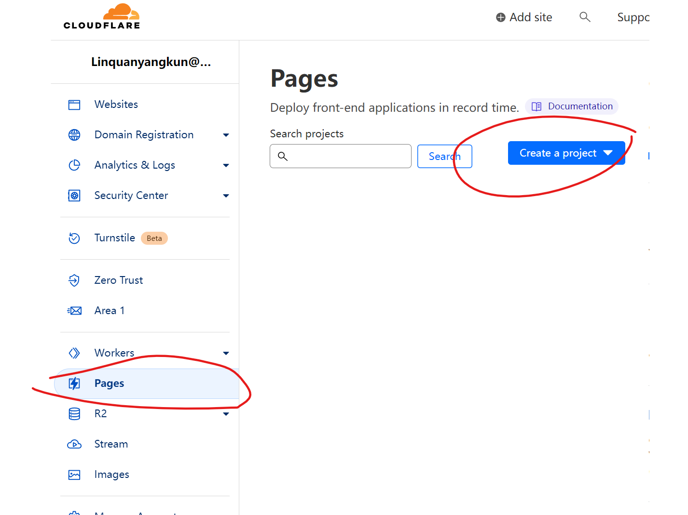

# 部署到 Cloudflare Worker

> 再次无比感谢 Cloudflare 对技术的探索，让我可以实现这个项目。

## Fork edgetunnel 本项目

https://github.com/zizifn/edgetunnel

请定期同步 fork，具体方式请参考 [Github 文档](https://docs.github.com/en/pull-requests/collaborating-with-pull-requests/working-with-forks/syncing-a-fork)。

## 注册 Cloudflare 账户

https://www.cloudflare.com/

## 访问 https://dash.cloudflare.com/

## 创建 Cloudflare Pages

## TOS

https://www.cloudflare.com/supplemental-terms/

> Unlike most Cloudflare products, the Developer Platform can be used to host content. Content stored on the Developer Platform (whether in conjunction with a Cloudflare storage offering or not) that we determine in our sole judgment to be illegal, harmful, or in violation of Section 5 of the Cloudflare Developer Platforms Supplemental Terms may be blocked or removed, and use of the Developer Platform for storage of such illegal or harmful content may result in suspension or termination of Cloudflare Services. While we generally try to provide notice of such action, we reserve the right to take action without notice as appropriate. For these purposes, illegal or harmful content includes but is not limited to: (a) content containing, promoting, or facilitating child sexual abuse material or human trafficking; (b) content that infringes on another person’s intellectual property rights or is otherwise unlawful; (c) content that discloses sensitive personal information, incites or exploits violence, or is intended to defraud the public; and (d) content that seeks to distribute malware, facilitate phishing, or otherwise constitutes technical abuse.

按照我对协议理解，Cloudflare Worker 是可以运行代理软件的。
