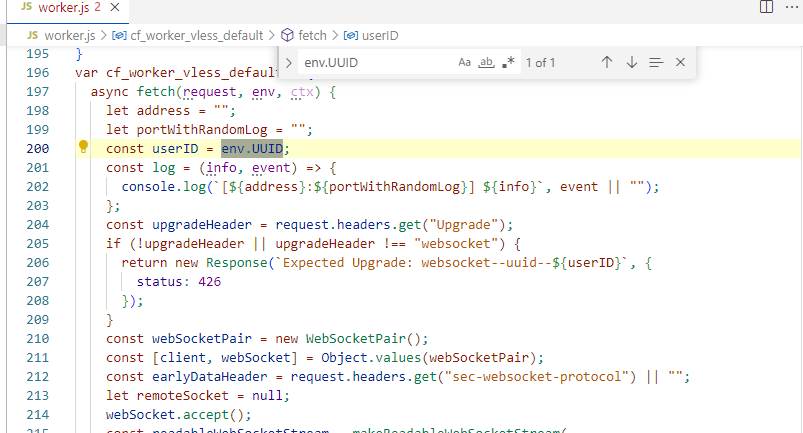

# 部署到 Cloudflare Worker

**本方式不推荐**，我不保证一直工作。除非你有特殊需求，并且你知道自己在做什么，否则请采用 [Cloudflare Pages](./cf-pages.md)

## Cloudflare Worker 代码

把下面代码 copy 到 Cloudflare Worker 在线编辑器内。

https://raw.githubusercontent.com/zizifn/edgetunnel/main/libs/cf-worker-vless/cf-worker-vless-dev.js

## 修改 UUID

::: warning
这是 VLESS over WS 配置。只有 UUID 是强制，其他参数无所谓。WS PATH 随便填写。
:::

